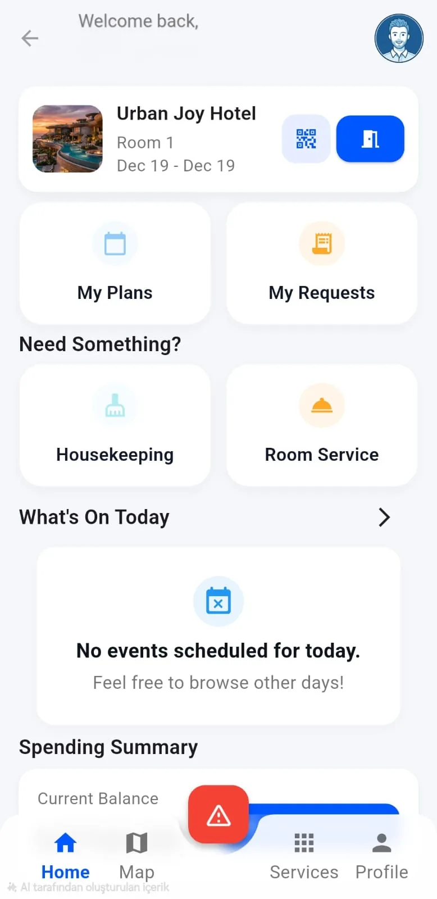
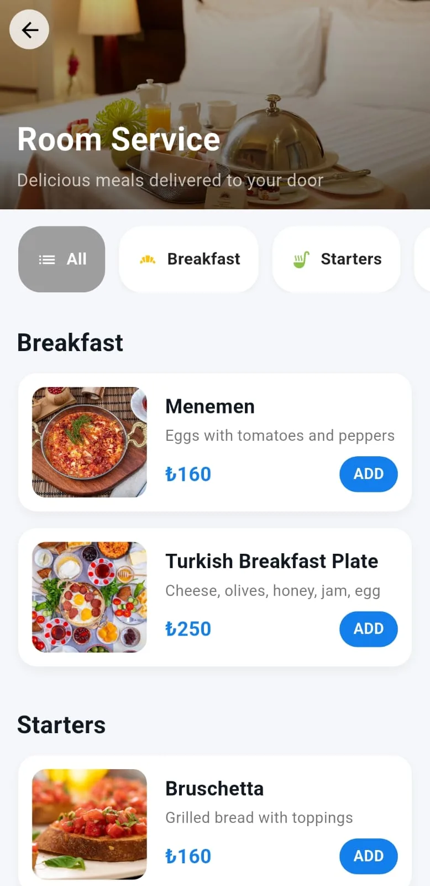
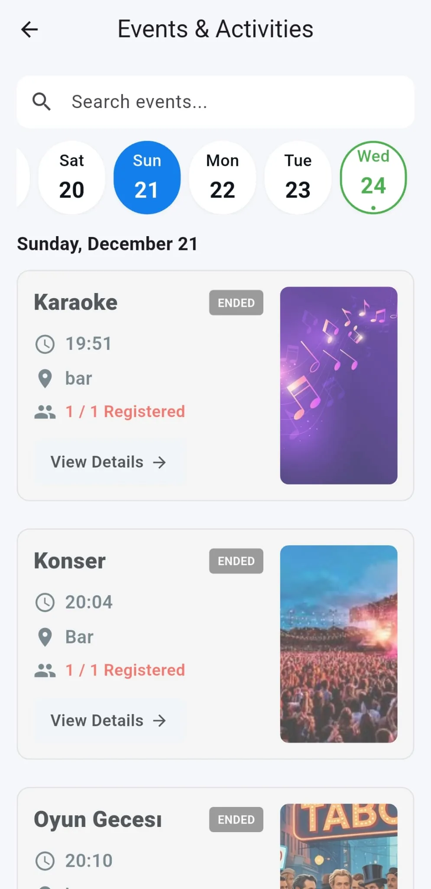

# InnJoy — Akıllı Otel Deneyimi 🏨

  

InnJoy, misafirlerinize unutulmaz bir konaklama deneyimi sunarken, otel yönetimini tek ekrandan tam kontrol altına almanızı sağlayan **yeni nesil bir akıllı otel yönetimi** sistemidir.

Bu depo, InnJoy projesinin tanıtım web sitesinin ([innjoy.app](https://innjoy.app)) kaynak kodlarını içermektedir.

🔗 **Canlı Website:** [innjoy.app](https://innjoy.app)
📥 **Demo Uygulamasını İndir:** [InnJoy APK](https://innjoy.app/InnJoy.apk)

---

## 🚀 Proje Hakkında

InnJoy, hem misafirler hem de otel yönetimi için iki ana deneyim sunar:

### 📱 Misafir Uygulaması (App)
Misafirlerin otel deneyimini en üst seviyeye çıkaran kapsamlı arayüz:
- **Hızlı Giriş:** PNR veya rezervasyon koduyla anında giriş.
- **Akıllı Dashboard:** Otel duyuruları ve harcamaların anlık takibi.
- **Mobil Anahtar:** QR kod ile temassız kapı açma (geliştirme aşamasında/opsiyonel).
- **Oda Servisi & Hizmetler:** Zengin menüden odanıza veya bulunduğunuz alana sipariş, Spa & Havuz randevuları.
- **Housekeeping:** Temizlik, havlu veya minibar taleplerini tek tıkla iletme.
- **Etkinlik Takvimi & Planlar:** Otel aktivitelerini takip edip hatırlatıcı ekleme.
- **Acil SOS Modu:** Anında otel görevlisi ile iletişime geçme imkanı ve acil çıkış yönlendirmesi.

### 🏢 Yönetim Paneli (Admin)
Otel operasyonlarınızı kolayca yönetin:
- **Genel İzleme (Dashboard):** Doluluk oranları, günlük özet raporları ve istatistikler.
- **Oda Yönetimi:** Odaları filtreleme, misafir atama ve güncel durum takibi.
- **Kategori Yönetimi:** Restoran, etkinlik ve spa menülerini düzenleme.
- **Talep Yönetimi:** Misafir siparişleri ve isteklerinin anlık yönetimi.
- **Acil Durum Merkezi:** SOS alarmlarına hızlı müdahale.

---

## 🛠️ Teknolojiler (Mobil Uygulama Altyapısı)

InnJoy mobil uygulaması aşağıdaki güçlü teknolojilerle geliştirilmiştir:
- **[Flutter](https://flutter.dev/):** Tek bir kod tabanıyla iOS ve Android'de yüksek performans.
- **[Firebase](https://firebase.google.com/):** Gerçek zamanlı veritabanı, kimlik doğrulama (Auth) ve bulut depolama.
- **[Cloud Firestore](https://firebase.google.com/docs/firestore):** Güvenli ve ölçeklenebilir NoSQL veri yönetimi.
- **[flutter_map](https://pub.dev/packages/flutter_map):** OpenStreetMap tabanlı harita entegrasyonu, konum hizmetleri ve acil çıkış yönlendirmeleri.

*(Web sitesi ise HTML, CSS ve Vanilla JavaScript kullanılarak statik ve performanslı bir yapıda geliştirilmiştir.)*

---

## 🔑 Demo & Test Hesabı

Uygulamayı test etmek için aşağıdaki demo hesap bilgilerini kullanabilirsiniz:

- **E-posta:** `appinnjoy@gmail.com`
- **Şifre:** `123456`

> ⚠️ *Not: Bu bir test hesabıdır. Lütfen gerçek kişisel bilgilerinizi girmeyiniz.*

---

## 📸 Ekran Görüntüleri

<b>Ekran Görüntülerini Görmek İçin Tıklayın</b>

 

  
  
  

---

## 👥 Ekibimiz

- **Berat Kaan Akcan** - Geliştirici | [LinkedIn](https://www.linkedin.com/in/berat-kaan-akcan-224781285/)
- **Doğukan Direksiz** - Geliştirici | [LinkedIn](https://www.linkedin.com/in/doğukan-direksiz-92aa6b334)
- **Berrin Al** - Geliştirici | [LinkedIn](https://www.linkedin.com/in/berrin-al/)

---

## 📞 İletişim & Geri Bildirim
Görüş ve önerileriniz için [Geri Bildirim Formu](https://forms.gle/2sfGnK5VJ4hYPome7) üzerinden bizimle iletişime geçebilirsiniz.

📧 **E-posta:** innjoyapp@gmail.com  
📸 **Instagram:** [@innjoy_app](https://www.instagram.com/innjoy_app)  
💻 **GitHub:** [dogukandireksiz/InnJoy](https://github.com/dogukandireksiz/InnJoy)
